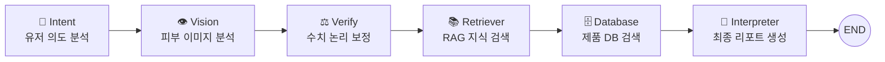

<p align="center">
  <h1 align="center">⭐ SKIN-STAR ⭐</h1>
  <p align="center">
    <b>AI 기반 피부 분석 & 맞춤형 스킨케어 추천 에이전트</b><br/>
    사진 한 장과 채팅 한 줄로, 당신의 피부에 딱 맞는 스킨케어 루틴을 처방받으세요.
  </p>
</p>

---

## 📌 프로젝트 개요

**SKIN-STAR**는 LangGraph 기반의 멀티 에이전트 워크플로우를 활용한 **AI 피부 상태 분석 및 맞춤 화장품 추천 서비스**입니다.

사용자가 피부 사진을 업로드하고 채팅으로 고민을 입력하면, 여러 AI 에이전트가 순차적으로 협업하여 **피부 타입 진단 → 전문 지식 검색 → 알레르기 필터링 → 맞춤 제품 추천**까지 원스톱으로 제공합니다.

### 핵심 가치

| 특징                                   | 설명                                                    |
| -------------------------------------- | ------------------------------------------------------- |
| 🔬 **컴퓨터 비전 피부 분석**            | MediaPipe Face Mesh + OpenCV로 홍조·유분 수치를 정량화  |
| 🤖 **LangGraph 멀티 노드 워크플로우**   | 6개 노드가 순차적으로 연결된 상태 기반 그래프 아키텍처  |
| 🧠 **GPT-4o 기반 지능형 해석**          | 생체 수치 보정, 의도 분석, 리포트 생성을 GPT-4o가 수행  |
| 📚 **RAG 기반 스킨케어 지식 검색**      | ChromaDB + HuggingFace 임베딩으로 전문 블로그 지식 검색 |
| 🛡️ **식약처 기준 알레르기 성분 필터링** | 25종 알레르기 유발 성분 + 유저 맞춤 성분 제외 기능      |
| 🛍️ **올리브영 실제 제품 DB 기반 추천**  | 4개 카테고리(토너/세럼/로션/크림) 루틴 순서 추천        |

---

## 🏗️ 시스템 아키텍처

### LangGraph 워크플로우 (6-Node Pipeline)



| 노드            | 역할                                              | 핵심 기술                                               |
| --------------- | ------------------------------------------------- | ------------------------------------------------------- |
| **Intent**      | 유저 메시지에서 제외 성분·관심사 추출             | GPT-4o, JSON 파싱                                       |
| **Vision**      | 피부 이미지에서 홍조/유분 수치 측정               | MediaPipe Face Mesh, OpenCV (Lab/HSV 색공간)            |
| **Verify**      | 센서 수치를 GPT로 논리적 보정 (가중 평균 0.3:0.7) | GPT-4o, 데이터 보정 로직                                |
| **Retriever**   | 피부 타입에 맞는 전문 지식 검색                   | ChromaDB, HuggingFace Embeddings (multilingual-e5-base) |
| **Database**    | 피부 타입·알레르기 기반 제품 필터링 검색          | SQLite, 올리브영 제품 DB                                |
| **Interpreter** | 종합 분석 리포트 및 루틴 추천 생성                | GPT-4o, LangChain LCEL                                  |

---

## 📂 프로젝트 구조

```
SKIN-STAR/
├── src/
│   ├── main.py                  # Streamlit 앱 엔트리포인트
│   ├── agents/
│   │   ├── interpreter.py       # 피부 리포트 생성 에이전트 (GPT-4o)
│   │   ├── allergy_check.py     # 알레르기 성분 필터링 에이전트
│   │   └── retriever.py         # RAG 지식 검색 에이전트 (ChromaDB)
│   ├── engine/
│   │   ├── vision_model.py      # 피부 분석 비전 모델 (MediaPipe + OpenCV)
│   │   └── allergy_check.py     # 식약처 기준 알레르기 성분 체크 엔진
│   ├── graph/
│   │   ├── state.py             # LangGraph 상태 스키마 정의 (GraphState)
│   │   ├── nodes.py             # 6개 워크플로우 노드 구현체
│   │   └── workflow.py          # LangGraph StateGraph 빌드 및 컴파일
│   ├── database/
│   │   ├── sqlite_db.py         # SQLite 제품 검색 쿼리 엔진
│   │   └── chroma.sqlite3       # ChromaDB 벡터 저장소
│   └── scripts/
│       ├── make_db.py           # 올리브영 CSV → SQLite DB 생성 스크립트
│       └── check_db.py          # DB 상태 확인 유틸리티
├── data/
│   └── sample_image.jpg         # 테스트용 피부 이미지 샘플
├── data_files/
│   ├── oliveyoung_skin_toner_*.csv
│   ├── oliveyoung_serum_ampoule_*.csv
│   ├── oliveyoung_lotion_*.csv
│   └── oliveyoung_cream_*.csv
├── db/
│   └── skin_products.db         # 올리브영 제품 SQLite 데이터베이스
├── item.py                      # 웹 크롤링 + ChromaDB RAG 데이터 수집
├── main_test.py                 # 비전 모델 독립 테스트 스크립트
├── requirements.txt             # Python 의존성 패키지 목록
└── .gitignore
```

---

## 🔧 기술 스택

| 분류                  | 기술                                                               |
| --------------------- | ------------------------------------------------------------------ |
| **AI 오케스트레이션** | LangGraph, LangChain, LangChain-OpenAI                             |
| **LLM**               | OpenAI GPT-4o                                                      |
| **컴퓨터 비전**       | MediaPipe Face Mesh, OpenCV, NumPy                                 |
| **벡터 DB (RAG)**     | ChromaDB, HuggingFace Embeddings (`intfloat/multilingual-e5-base`) |
| **제품 DB**           | SQLite (SQLAlchemy)                                                |
| **웹 UI**             | Streamlit                                                          |
| **데이터 수집**       | BeautifulSoup4, Trafilatura, Requests                              |
| **데이터 처리**       | Pandas, scikit-learn                                               |
| **언어**              | Python 3.10+                                                       |

---

## 🚀 설치 및 실행

### 1. 레포지토리 클론

```bash
git clone https://github.com/Jinkyuu98/Project2.git
cd Project2
```

### 2. 가상환경 생성 및 패키지 설치

```bash
python -m venv .venv
.venv\Scripts\activate       # Windows
pip install -r requirements.txt
```

### 3. 환경 변수 설정

프로젝트 루트에 `.env` 파일을 생성하고 OpenAI API 키를 입력합니다:

```env
OPENAI_API_KEY=sk-your-api-key-here
```

### 4. 제품 데이터베이스 구축 (최초 1회)

```bash
python src/scripts/make_db.py
```

### 5. RAG 지식 데이터 수집 (최초 1회)

```bash
python item.py
```

### 6. 애플리케이션 실행

```bash
streamlit run src/main.py
```

브라우저에서 `http://localhost:8501` 로 접속하여 서비스를 사용합니다.

---

## 💡 사용 방법

1. **피부 사진 업로드** — 얼굴이 잘 보이는 피부 사진을 업로드합니다
2. **고민 입력** — 채팅창에 피부 고민을 자유롭게 입력합니다
   - 예: `"리모넨은 빼고 홍조 위주로 분석해줘!"`
   - 예: `"지성 피부인데 가성비 좋은 루틴 추천해줘"`
3. **AI 분석 대기** — 6개 에이전트가 순차적으로 분석을 수행합니다
4. **결과 확인** — 피부 타입 진단, 전문 지식 가이드, 맞춤 제품 루틴을 확인합니다

---

## 📊 분석 결과 예시

분석 완료 후 다음과 같은 정보가 제공됩니다:

- **피부 타입 진단** — 건성 / 지성 / 복합성 / 민감성 조합
- **상세 피부 지표** — 홍조 수치 (0-100), 유분 수치 (0-100)
- **전문 지식 가이드** — RAG 기반 피부타입별 케어 가이드
- **AI 추천 데일리 루틴** — 토너 → 세럼 → 로션 → 크림 4단계 루틴
- **알레르기 안전성 검사** — 제품별 식약처 기준 주의 성분 표시

---

## 📦 데이터 소스

| 데이터                   | 출처                       | 용도                        |
| ------------------------ | -------------------------- | --------------------------- |
| 제품 정보 (4개 카테고리) | 올리브영 (CSV)             | SQLite 기반 제품 추천 DB    |
| 스킨케어 전문 지식       | 네이버 블로그, 티스토리 등 | ChromaDB 기반 RAG 지식 검색 |
| 알레르기 유발 성분 25종  | 식약처 고시                | 제품 안전성 필터링 기준     |

---

## ⚠️ 유의 사항

- 본 서비스의 분석 결과는 **AI 시각 분석 모델에 기반한 참고용 리포트**이며, 의학적 진단을 대체하지 않습니다.
- GPT-4o API 사용을 위한 **OpenAI API 키**가 반드시 필요합니다.
- 최초 실행 시 HuggingFace 임베딩 모델(`intfloat/multilingual-e5-base`) 다운로드에 시간이 소요될 수 있습니다.
